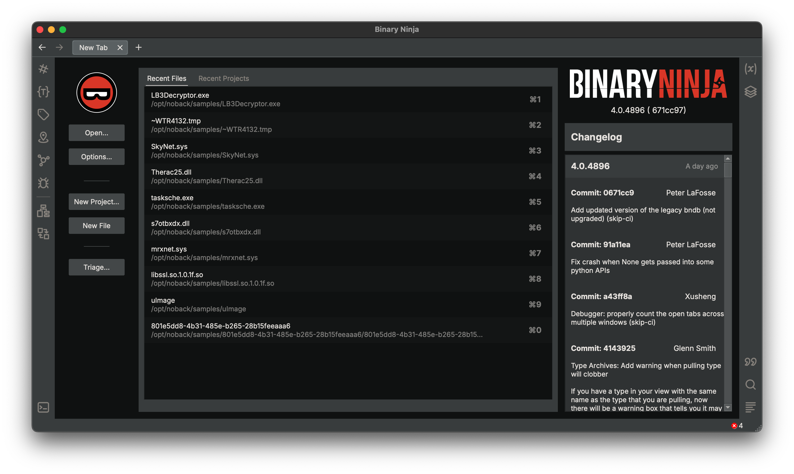
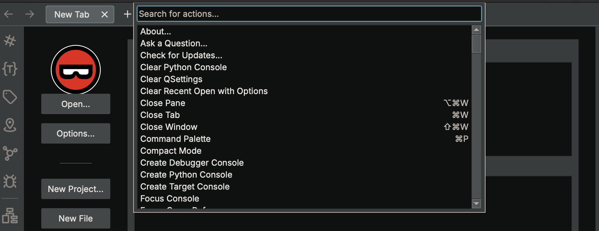

# Getting Started

Welcome to Binary Ninja. This introduction document is meant to quickly guide you over some of the most common uses of Binary Ninja. If you're interested in more detailed information, check out the [User Manual](./guide/index.md).

## Installing Binary Ninja

The download links you receive after purchasing expire after 72 hours but as long as you have [active support](https://binary.ninja/faq/#updates) you can [request download links](https://binary.ninja/recover/) any time!
### Linux

Because Linux install locations can vary widely, we do not assume that Binary Ninja has been installed in any particular folder on Linux. Instead, first unzip the installation zip wherever you wish to install BN. Next, for paid versions, run `./binaryninja/scripts/linux-setup.sh`. This sets up file associations, icons, and adds BN's Python library to your python path. Adding the library to your path is most helpful for headless functionality in commercial licenses, but even on non-commercial plugins it can help IDE's find the type information to make plugin development easier. Run the script with `-h` to see customization options.

### MacOS

To install on MacOS, simply drag-and-drop the app bundle from the DMG to the desired location.

### Windows

To install on Windows, use the installer linked from the email you received after purchase. You'll need to choose whether to install globally or to your local user path during the install process.

## License

When you first run Binary Ninja, it will prompt you for your license key. You should have received your license key via the same email that included your download links. If not, please contact [support](https://binary.ninja/support).

## Opening Files

While there are [more ways than shown here](./guide/index.md#loading-files), the most common ways to open a file are:

 - Drag-and-drop
 - File Open
 - Run via CLI

But you can also change how analysis happens using [open with options](./guide/index.md#loading-files).

## UI Basics

By default, you'll see four main areas in Binary Ninja:

1. Symbol List (one of many [sidebar panels](./guide/index.md#the-sidebar))
1. [Cross References](./guide/index.md#cross-references-pane)
1. Main View (defaults to High Level IL and can have many [panes](./guide/index.md#tiling-panes))
1. [Feature Map](./guide/index.md#feature-map)

Not enabled by default but can be made visible is the global area which includes the [scripting console](./guide/index.md#script-python-console) and log window.

Make sure to check out the many view options available in the various ☰ ("hamburger") menus. However, most configuration settings are available in the [settings](./guide/settings.md) menu. (`[CMD/CTRL] ,` is the hotkey for settings) in the top right of each pane allows for additional customization, including locking the pane to a single function.

### Interacting

One of the most useful features of Binary Ninja is that everything can be quickly and easily accessed through a [command-palette](./guide/index.md#command-palette) (`[CMD/CTRL] p`). You'll be surprised how often it saves you from looking through menus to find out just what you need. Also, any action in the command-palette can be assigned to a [custom hotkey](./guide/index.md#custom-hotkeys). That said, here are a few of the more useful default hotkeys:

 - `[ESC]` : Navigate backward
 - `[SPACE]` : Toggle between linear view and [graph view](./guide/index.md#graph-view)
 - `[F5]`, `[TAB]` : Toggle between Pseudo C and disassembly view
 - `g` : Go to an address or symbol
 - `n` : Name a symbol
 - `;` : Add a comment
 - `i` : Cycle between disassembly, LLIL, MLIL and HLIL
 - `y` : Change type of the currently selected element
 - `1`, `2`, `4`, `8` : Change type of a data variable to the indicated width in bytes (creates a variable if none exists)
 - `d` : Switch between data variables of various widths
 - `r` : Change the data type to single ASCII character
 - `o` : Create a pointer data type

For more hotkeys, see the [User Manual](./guide/index.md).

## Intermediate Languages

Binary Ninja is one of the most advanced binary analysis platforms, and it has a unique stack of related intermediate languages. If that gets you excited, you'll surely want to check out the [developer guide](./dev/bnil-overview.md) for more information. If it doesn't mean anything to you, no worries, here's a few tips to make your life easier. The default view is "High Level IL". It looks and reads almost like pseudo code. There's a few extra notations (usually just around comparisons for whether they are signed or not, or between moves of data indicating the size of the operation) but it should otherwise be very understandable.

Many of the IL behaviors and views are customizable via settings. If you prefer disassembly or even [Pseudo C](./guide/index.md#pseudo-c) as your default view, no worries, just check out the `UI`/`view.graph` and `view.linear` settings. Likewise, there are several settings available under the "hlil" heading.

## Using Plugins

Plugins can be installed by one of two methods, either automatically by using the [Plugin Manager](./guide/plugins.md#plugin-manager), or manually by copying the plugin to the appropriate [folder](./guide/index.md#user-folder).

## Debugger

Binary Ninja includes a debugger that can debug executables on Windows, Linux, and macOS.

For more detailed information, see the [debugger guide](./guide/debugger.md).

## Updates

By default, Binary Ninja is configured to automatically update itself to any new stable releases. However, there are much more frequent updates with fixes and new features available by switching to the Development Branch using the [update channel](./guide/index.md#updates) dialog.

## What's next?

- Consider writing your first [plugin](./dev/index.md)
- Watch our [Binary Ninja Basics](https://www.youtube.com/watch?v=xKBQatwshs0&list=PLCVV6Y9LmwOgqqT5obf0OmN9fp5495bLr) videos (or any other [videos on our channel](https://www.youtube.com/watch?v=xKBQatwshs0&list=PLCVV6Y9LmwOgqqT5obf0OmN9fp5495bLr&index=1))
- Join one of our [live streams](https://www.youtube.com/@vector35/live)
- Attend one of our [trainings](https://binary.ninja/training/)
- Read the rest of the more detailed [User Manual](./guide/index.md)
